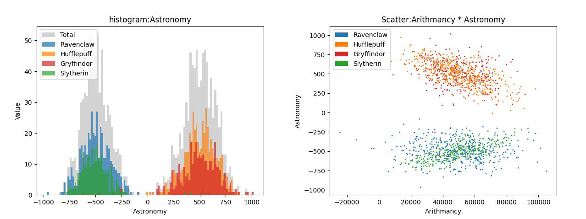
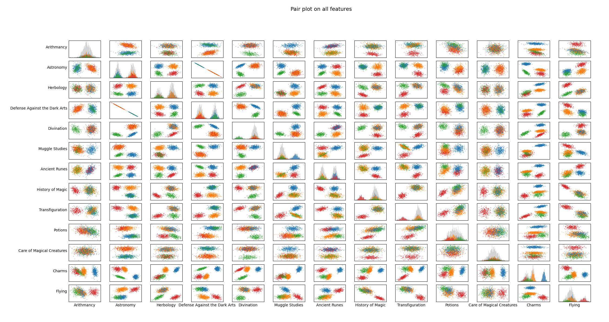

# Data Science X Logistic Regression

**DSLR** is a **practice project** to learn machine learning **from zero**,  
by re-implementing fundamental machine learning algorithms.

The purpose of this repository is to understand how classic ML models work internally. This project builds a generalized logistic regression classifier with python to predict a Hogwarts house based on student features.

Logistic regression is usually used for binary classification tasks, this project applies a one-vs-all strategy to handle the multi-class setting. The implementation is highly modular and encapsulated, so the same class can be reused for other datasets. 

This project also includes a data science part with analysis and visualization to give a better intuition to help understanding the dataset.

---

## Highlights

- **From scratch** → Starting from no external ML frameworks, everything implemented from scratch, only Numpy is used for matrix operations
- **Educational** → designed as a step-by-step learning exercise  
- **Modularity** → designed as encapsulated classes, can be reused in different projects.

---

## Requirements

The project is built with Python. Therefore, some dependencies are required.  

The project includes a `venv.sh` and `requirements.txt` to help you set up a virtual environment and install the necessary packages:  

```bash
bash venv.sh
source venv/bin/activate
```

## Methodology

Similar to linear regression, logistic regression uses gradient descent to minimize a loss function. However, it applies the sigmoid function to map the weighted sum of inputs into a probability value between $(0,1)$, representing the likelihood of belonging to a given class.

For multi-class classification, we extend the binary case using the one-vs-all approach.

### Loss function(Cross Entropy Loss):

$$
J(\theta) = -\frac{1}{m} \sum_{i=1}^m 
\Big[ y_i \log\big(h_\theta(x^{(i)})\big) + (1-y_i)\log\big(1-h_\theta(x^{(i)})\big) \Big]
$$

where the hypothesis function is defined as:

$$
h_\theta(x) = g(\theta^T x)
$$

### Sigmoid Function:

$$
g(z) = \frac{1}{1+e^{-z}}
$$

### Gradient of the Loss Function

Using the chain rule, the partial derivative with respect to each parameter (both weights and bias) can be derived.  
The result is similar to linear regression, with the difference that the hypothesis function uses the sigmoid activation:

$$
\frac{\partial J}{\partial \theta_j} 
= \frac{1}{m} \sum_{i=1}^m \big(h_\theta(x^{(i)}) - y^{(i)}\big)x_j^{(i)}, 
\quad j = 0, 1, \dots, n
$$

where 

$$ 
h_\theta(x^{(i)}) = \sigma(\theta^T x^{(i)}) 
$$

and $\sigma(z) = \frac{1}{1+e^{-z}}$ is the sigmoid function.

---

## Programs  

0. **Describer**  
   - Usage:  
     ```bash
     python describe.py <data.csv>
     ```  
   - Describe the training dataset.  

1. **Visualizer**  
   - Usage:  
     ```bash
     python histogram.py <data.csv>
     python scatter_plot.py <data.csv>
     python pair_plot.py <data.csv>
     ```  
   - Plots the training dataset with histogram, and scatter plot.  
   - Displays intuitively the distribution of data. 

   
   

2. **Trainer**  
   - Usage:  
     ```bash
     python logreg_train.py <dataset_train.csv>
     ```  
   - Takes a CSV dataset with labeled classes.  
   - Trains the logistic regression model using gradient descent.  
   - Saves the trained weights into `output/weights.txt`.  

3. **Predictor**  
   - Usage:  
     ```bash
     python logreg_predict.py <dataset_train.csv> <dataset_test.csv> <weights.txt>
     ```  
   - Loads trained weights from `weights.txt`.  
   - Predicts class probabilities for given test samples.  
   - Outputs predicted class csv.
   - One-vs-all tasks with multi models training.
---

---

## 🎯 Goal

By the end of this project, the repository will contain:  
1. A minimal set of ML algorithms.  
2. Python scripts & notebooks for visualizing training results  
3. A clean and educational codebase that shows **how ML works under the hood**


## License
This project is licensed under the MIT License - see the [LICENSE](LICENSE) file for details.
